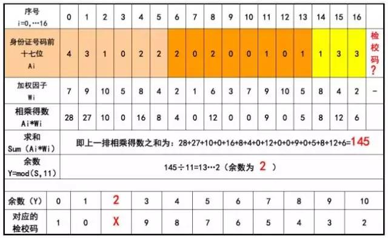

# 中国（大陆）18位身份证号码检查

=======================

## 身份证号码说明

- 身份证号码由17位数字本体码和1位数字校验码组成。
- 身份证号码组成（按索引，如下图）：
  - 0-5 地址码
  - 6-13 出生年月日
  - 14-16 顺序码
  - 16 奇数代表男性，偶数代表女性
  - 17 校验码
- 验证规则如下：
  - a. 将身份证号码前17位数分别乘以不同的系数。
  - b. 将相乘的所有结果相加。
  - c. 将和与11取余数。
  - d. 将余数为索引找到对应校验码。
  - e. 和第17位进行比较，检查是否相等。



*图片来源网络*

## Bench

- Test Host
Apple Mac mini 2023 M2 chip 16GB mem


- golang

```shell
$ go test -benchmem -run=^$ -bench ^BenchmarkParse$
goos: darwin
goarch: arm64
pkg: github.com/cuipeiyu/china-id
BenchmarkParse-8   	 3918559	       280.1 ns/op	      24 B/op	       1 allocs/op
PASS
ok  	github.com/cuipeiyu/china-id	1.733s
```

- rust

```shell
$ cargo bench
   Compiling china-id v0.1.2 (/Users/cui/Projects/github.com/cuipeiyu/china-id)
    Finished bench [optimized] target(s) in 0.95s
     Running unittests src/lib.rs (target/release/deps/china_id-87f7b8907f156e71)

running 1 test
test tests::ut_parse ... ignored

test result: ok. 0 passed; 0 failed; 1 ignored; 0 measured; 0 filtered out; finished in 0.00s

     Running benches/benchmark.rs (target/release/deps/benchmark-6f5420af82dbb12b)
WARNING: HTML report generation will become a non-default optional feature in Criterion.rs 0.4.0.
This feature is being moved to cargo-criterion (https://github.com/bheisler/cargo-criterion) and will be optional in a future version of Criterion.rs. To silence this warning, either switch to cargo-criterion or enable the 'html_reports' feature in your Cargo.toml.

Gnuplot not found, using plotters backend
parse                   time:   [404.83 ns 405.06 ns 405.32 ns]
                        change: [+32.779% +33.581% +34.605%] (p = 0.00 < 0.05)
                        Performance has regressed.
Found 11 outliers among 100 measurements (11.00%)
  1 (1.00%) high mild
  10 (10.00%) high severe

```
